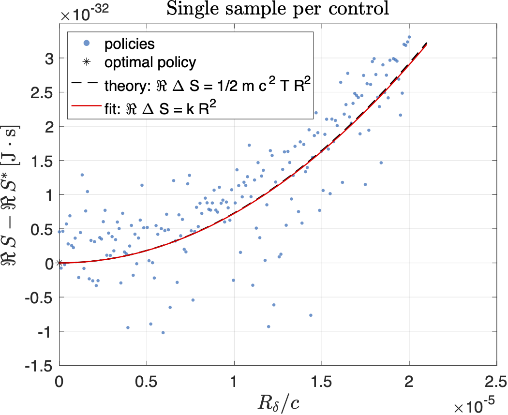
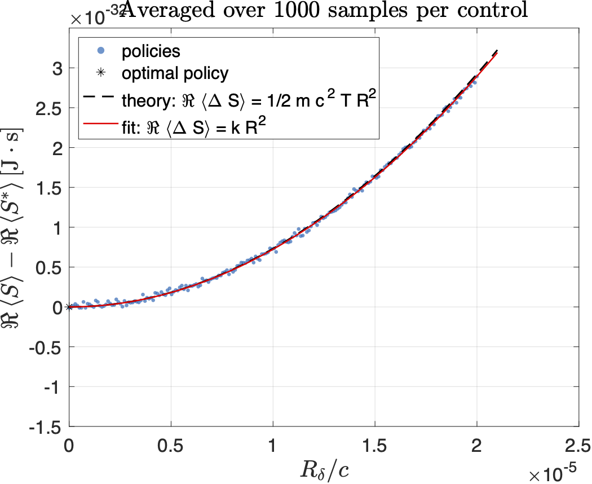
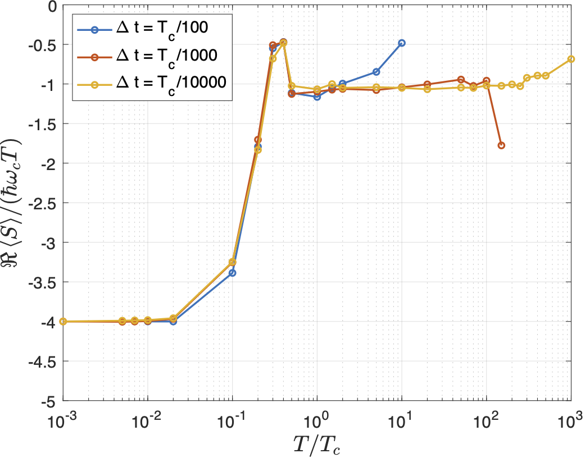
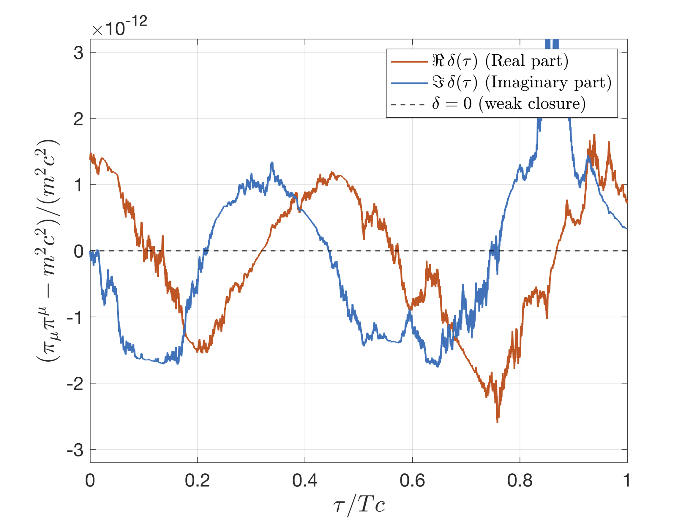
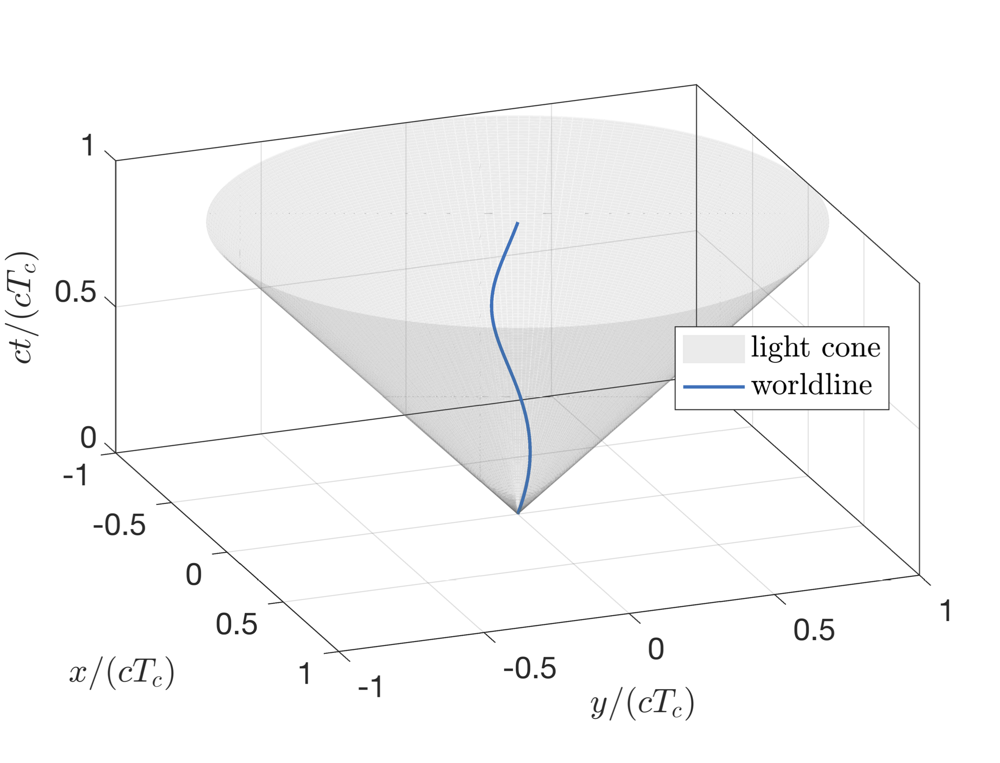
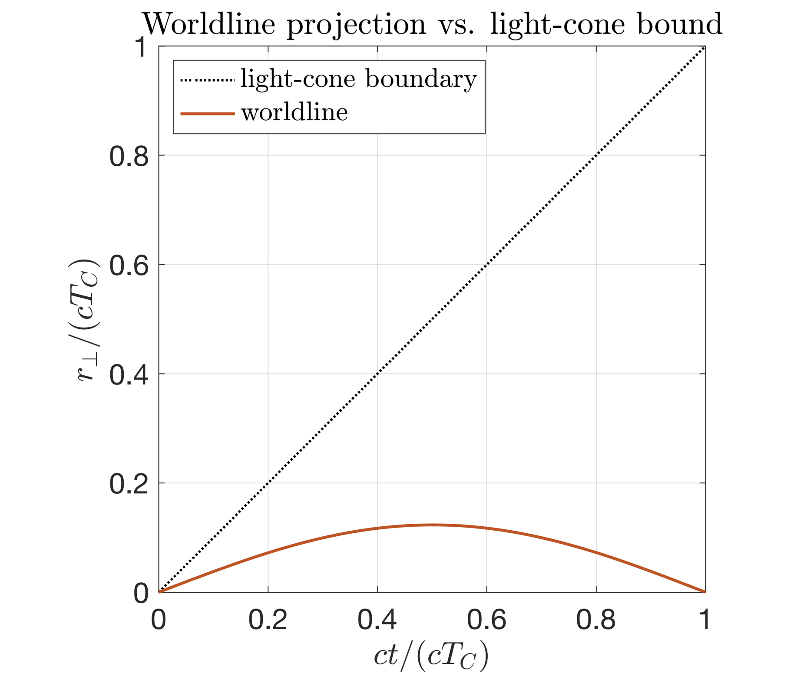
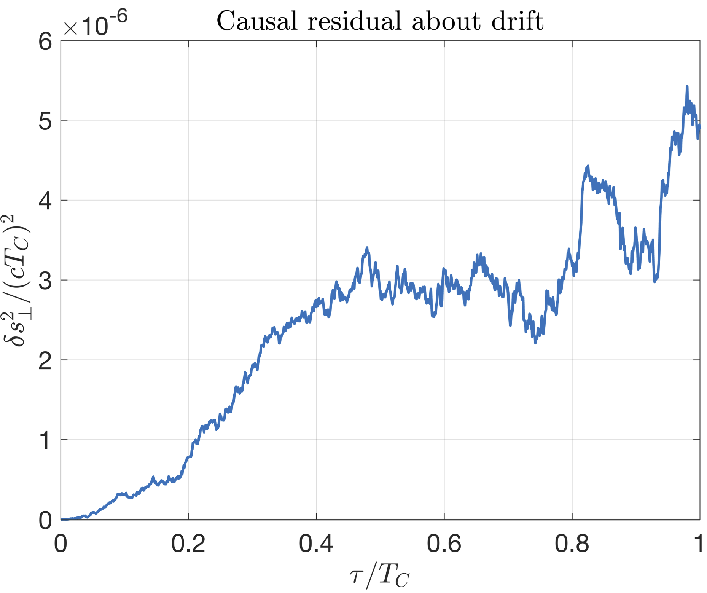

# Dirac–Landau Complex SOC

This repo accompanies the paper *“Preserving Mass Shell Condition in the Stochastic Optimal Control Derivation of the Dirac Equation”*. 
It contains MATLAB scripts to reproduce the figures and the action-components table.

## How to run

Requirements: MATLAB (tested on R2023b).

1) **Local optimality test**  
   Runs admissible perturbations around the optimal drift and saves one figure per run.
   
   Edit `run_demo_local_optimality.m`. Set `N_avg` to 1 or 1000.
   ```matlab
   N_avg = 1000;
   run('run_demo_local_optimality.m')
   ```
   Outputs: `figures/figure_local_optimality_M1.pdf`, `figures/figure_local_optimality_M1000.pdf`
   
   These are used in figure 1 in the manuscript.
2) **Action components report**  
   Computes the mean kinetic, electromagnetic, spin, and total action under the optimal drift and prints a small table to the console.  
   ```matlab
   run('run_optimal_action_report.m')
   ```
   These are used in table 1 in the manuscript.

3) **Time–step stability sweep**  
   Sweeps the horizon/step size and plots the normalised action to assess stability.
   
   Edit `run_sweep_T_report_S_statistics.m`. Set `Ntc_per_Tc` to 100, 1000, or 10000.
   ```matlab
   Ntc_per_Tc = 1000;
   run('run_sweep_T_report_S_statistics.m')
   ```
   Output: `data/S_sweep_T_raw_*.mat`

   Post-process those `.mat` files:
   ```matlab
   files = {
      'data/S_sweep_T_raw_Nrun1000_NtcPerTc100.mat'
      'data/S_sweep_T_raw_Nrun1000_NtcPerTc1000.mat'
      'data/S_sweep_T_raw_Nrun1000_NtcPerTc10000.mat'
   };
   run('run_sweep_T_plot_S_postprocess.m')
   ```
   Output: `figures/figure_S_sweep_T.pdf`

   This is used in figure 2 in the manuscript.

4) **Complex mass-shell and light-cone geometry**  
   Generates the complex/real mass-shell surfaces with overlaid SOC drifts.
   ```matlab
   run('run_lightcone_mass_shell.m')
   ```
   Output: `figures/figure_complex_shell_and_drifts.pdf`

   This is used in figure 3 in the manuscript.

7) **Mass-shell residual versus time**  
   Weak mass-shell deviation plot for a representative trajectory.
   ```matlab
   run('run_weak_mass_shell_deviation.m')
   ```
   Output: `figures/figure_mass_shell_deviation.pdf`

   This is used in figure 4 in the manuscript.

6) **Worldline light-cone diagnostics**  
   3D worldline cone and two 2D diagnostics (projection and causal residual).
   ```matlab
   run('run_worldline_cone_3D.m')   % 3D only
   run('run_worldline_cone_2D.m')   % the two 2D plots
   ```
   Outputs: `figures/figure_worldline_cone_3D.pdf`, `figures/figure_cone_2D_rperp_vs_z0.pdf`, `figures/figure_causal_residual_about_drift.pdf`

   These are used in figures 5 and 6 in the manuscript.

## Figures

  
Excess action $\Delta S$ vs normalised control distance $R_\delta/c$ for perturbations around the optimal control $w^\star$; *single realisation per control* (stochastic variability can yield $S<S^\star$ even at small $R_\delta/c$).

  
Same test but *averaged over 1000 trajectories per control*; the minimum at $R_\delta/c=0$ is quadratic, with theoretical curvature $\tfrac{1}{2}\,m c^2 T$ (i.e., $\mathbb{E}[\Delta S]\approx \tfrac{1}{2}\,m c^2 T\,R_\delta^2$ for small $R_\delta/c$).

  
Time–step stability of the normalised stochastic action $\Re\langle S\rangle/(\hbar\omega_c T)$ vs $T/T_c$ for $\Delta t=T_c/100,\ T_c/1000,\ T_c/10000$; the value relaxes toward the Dirac–Landau prediction set by $(n,s)$.

  
Real-momentum slice ($p_z=0$) showing the light cone (grey), classical shell $S_0$ (blue), a representative approximate quantum mass shell $\widetilde S_{\varrho_{\mathrm{eff}}}$ (light blue), and overlaid projected SOC drifts $\Re\pi(\tau)/mc$.

  
Dimensionless residual $\delta(\tau) = [\pi_\mu\pi^\mu - m^2 c^2]/(m^2 c^2)$ along a trajectory; real (red) and imaginary (blue) parts stay at $\mathcal{O}(10^{-12})$ with bounded oscillations.

  
Real-projected trajectory $(x,y,ct)$ together with the coordinate-space light-cone surface $ct=\sqrt{x^2+y^2}$, shown in dimensionless units $(\cdot)/(cT_c)$.

  
Spacetime projection $r_\perp$ versus $ct$; the cone boundary.

  
Projected causal residual about drift $\delta s_\perp^2(\tau)$ normalised by $(cT_c)^2$, comparing the trajectory to its drift-only reconstruction.

## Results table (paper values)

Mean physical action components normalised by $\hbar\omega_c T$ (electron in uniform $B$, Landau gauge).

> Notes: the EM piece includes the Itô covariation +1/2 shift; 
> the physical kinetic action satisfies $S_{kin}=0$, and the spin-dependent drift bias is removed by the counterterm \(\Delta S_{\rm kin}(n,s)\) derived in Appendix A.5; 
> numbers below are the reported means, with “Theory” the Dirac–Landau value.

| State (n,s) | ⟨SEM⟩\_phys | ⟨SSP⟩\_phys | ⟨S_kin⟩\_phys | ⟨S_tot⟩\_phys | Theory ⟨S\_tot⟩ |
|---|------------:|---:|--------------:|--:|----------------:|
| (0, −1) |     −0.4826 | +0.5000 |       +0.0000 | +0.0174 |         +0.0000 |
| (0, +1) |     −0.4829 | −0.5000 |       +0.0000 | −0.9829 |         −1.0000 |
| (1, −1) |     −1.4927 | +0.5000 |       -0.0562 | −1.0490 |         −1.0000 |
| (1, +1) |     −1.4922 | −0.5000 |       -0.0562 | −2.0484 |         −2.0000 |

---

**Normalisation:** $S_{\rm norm}=S/(\hbar\omega_c T)$, typical settings in the paper use $B=0.1\,\text{T}$, $T=5T_c$, $N_{\rm traj}=10^4$, $N_t=10^4$.
