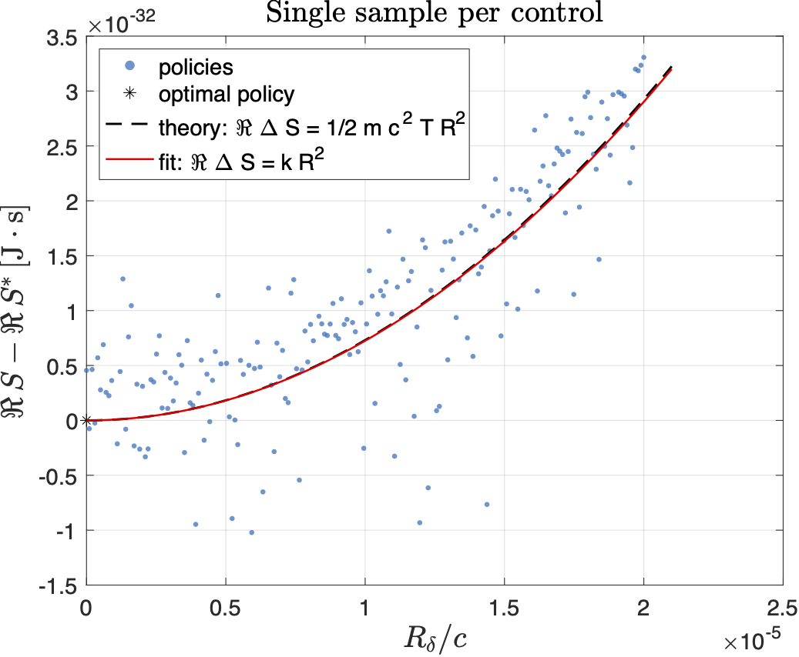

# Dirac–Landau Complex SOC — Repro Scripts

This repo accompanies the paper *“Preserving Mass Shell Condition in the Stochastic Optimal Control Derivation of the Dirac Equation”*. 
It contains three small MATLAB scripts to reproduce the figures and the action-components table.

## How to run

Requirements: MATLAB (tested on R2023b).

1) **Local optimality test**  
   Runs admissible perturbations around the optimal drift and saves one figure per run.
   
   Edit `run_demo_local_optimality.m`. Modify `N_avg` parameter possible values: 1 and 100.
   ```matlab
   N_avg     = 100;
   ```   
   ```matlab
   run('run_demo_local_optimality.m')
   ```  
   Outputs: `local_optimality_M1.pdf`, `local_optimality_M100.pdf`

3) **Action components report**  
   Computes the mean kinetic, electromagnetic, spin, and total action under the optimal drift and prints a small table to the console.  
   ```matlab
   run('run_optimal_action_report.m')
   ```

4) **Time–step stability sweep**  
   Sweeps the horizon/step size and plots the normalised action to assess stability.
   
   Edit `run_sweep_T_report_S_statistics.m`. Modify `Ntc_per_Tc` parameter possible values: 100, 1000 and 10000.
   ```matlab
   Ntc_per_Tc     = 1000;
   ```   
   ```matlab
   run('run_sweep_T_report_S_statistics.m')
   ```  
   Output: `S_sweep_T.pdf`

## Figures

  
Excess action $\Delta S$ vs normalised control distance $R_\delta/c$ for perturbations around the optimal control $w^\star$; *single realisation per control* (stochastic variability can yield $S<S^\star$ even at small $R_\delta/c$).

  
Same test but *averaged over 100 trajectories per control*; the minimum at $R_\delta/c=0$ is quadratic, with theoretical curvature $\tfrac{1}{2}\,m c^2 T$ (i.e., $\mathbb{E}[\Delta S]\approx \tfrac{1}{2}\,m c^2 T\,R_\delta^2$ for small $R_\delta/c$).

  
Time–step stability of the normalised stochastic action $\Re\langle S\rangle/(\hbar\omega_c T)$ vs $T/T_c$ for $\Delta t=T_c/100,\ T_c/1000,\ T_c/10000$; the value relaxes toward the Dirac–Landau prediction set by $(n,s)$.

## Results table (paper values)

Mean physical action components normalised by $\hbar\omega_c T$ (electron in uniform $B$, Landau gauge).

> Notes: $S_{kin}=0$ by on–shell closure; the EM piece includes the Itô covariation +1/2 shift; numbers below are the reported means, with “Theory” the Dirac–Landau value.

| State (n,s) | ⟨SEM⟩\_phys | ⟨SSP⟩\_phys | ⟨S_kin⟩\_phys | ⟨S_tot⟩\_phys | Theory ⟨S\_tot⟩ |
|---|---:|---:|---:|---:|---:|
| (0, −1) | −0.4826 | +0.5000 | 0.0000 | +0.0174 | 0.0000 |
| (0, +1) | −0.4829 | −0.5000 | 0.0000 | −0.9829 | −1.0000 |
| (1, −1) | −1.4929 | +0.5000 | 0.0000 | −0.9929 | −1.0000 |
| (1, +1) | −1.4923 | −0.5000 | 0.0000 | −1.9923 | −2.0000 |

---

**Normalisation:** $S_{\rm norm}=S/(\hbar\omega_c T)$, typical settings in the paper use $B=0.1\,\text{T}$, $T=5T_c$, $N_{\rm traj}=10^4$, $N_t=10^4$.
